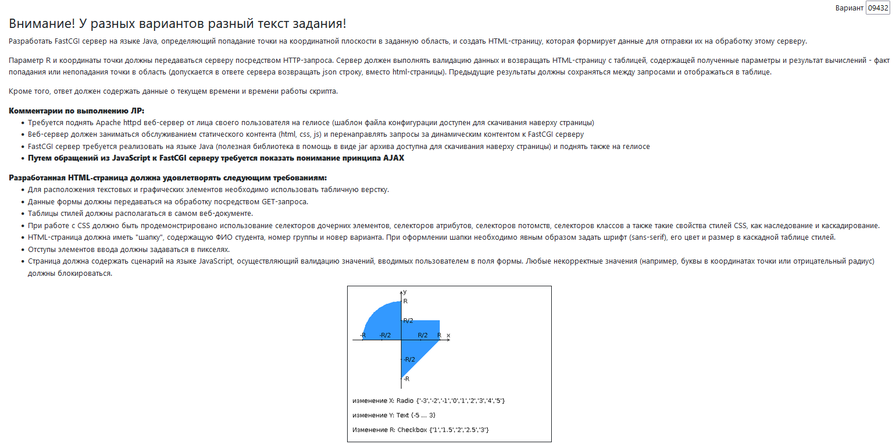

# Задание

# Как это запустить?
Я просто напишу как это делал, кому будет нужно - разберется (в моем случае проект лежит в папке ~/web/lab1)
1) Создаем папку со статическим контентом, кладем туда index.html, остальной статический контент можем хранить как угодно 
(все пути прописываются относительно этой папки, можно посмотреть как это сделано в static/index.html)
2) Создаем папку httpd-root, в ней у нас 
    - conf/httpd.conf - файл с настройками для Apache
    - fcgi-bin/app.jar - наш fastcgi сервер
    - mutex-dir - каталог для mutex default
3) В httpd.conf прописываем свои порты и пути до файлов (все что ниже комментария # Custom settings)
4) Запускаем httpd на helios
```bash
httpd -f ~/web/lab1/httpd-root/conf/httpd.conf -k start
```
5) Запускаем fast-cgi (порт здесь тот, который указан в FastCgiExternalServer -host)
```bash
java -DFCGI_PORT=35473 -jar ~/web/lab1/httpd-root/fcgi-bin/app.jar
```
6) Пробросим себе порты на комп (s409429 - юзернейм на helios, 38141 - порт, который слушает Apache)
```bash
ssh -p 2222 s409429@helios.cs.ifmo.ru -L 8888:localhost:38141
```
7) Осталось проверить, что все работает 
    - html страница доступна по `http://localhost:8080`
    - fast-cgi сервер доступен по `http://localhost:8080/fcgi-bin`